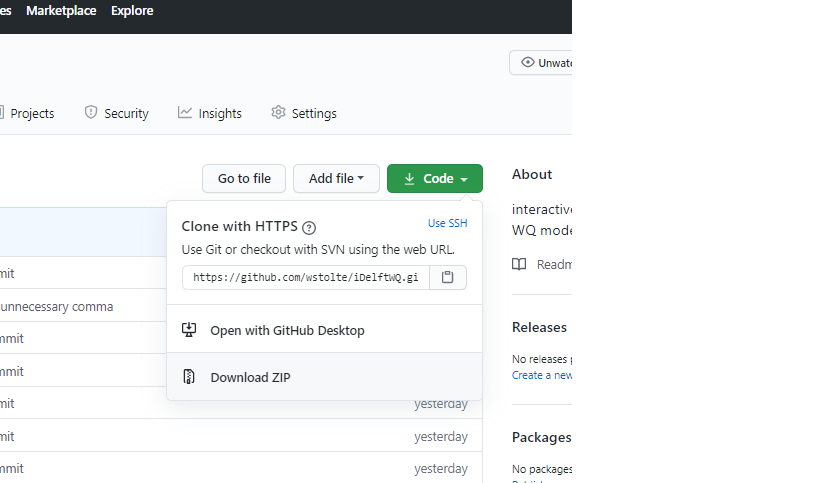

# iDelftWQ

Interactive inspection of Delft3D FM WQ model history output

## How to

The output should be in Delft3D NetCDF (his.nc) format, accessible by the machine where the app is running. Normally, at Deltares, the model output is on the project (p:) disk. Copy the complete path of the output into the app (time series tab) and choose the parameter(s) and location(s) to view the results. 

There is yet no implementation of target diagrams and ecoplot. Also, a comparison with observations can not yet be made.

# Installatian as a local viewer

The app code is stored on Github (https://github.com/wstolte/iDelftWQ). There are two ways to get the code to your own machine and run it. 

1. Download the zipped repository, unpack it and run it using Rstudio. This way, code can only be downloaded. Any local modifications of the code can not be submitted to the repository.

 
 

2. Get a github account if you do not have it already. Install Git on your local machine, and start an Rstudio project from Github. This is a bit more complicated, but the advantage is that you can submit any contributions that you make to the Github repository. Stepwise:
    + Make sure you have a Github account (https://github.com/) 
    + Install Git locally, and make sure that Rstudio can find it (http://www.geo.uzh.ch/microsite/reproducible_research/post/rr-rstudio-git/)
    + Start Rstudio
    + Start new project from Github
        + File - New Project
        + Version Control
        + Git
        + Fill in the complete URL to the Github project (https://github.com/wstolte/iDelftWQ)
        + Choose an appropriate folder for the project
    + Rstudio will now make a local copy of the repository
    
Once the project is open on your local machine, make sure that you have access to the his.nc that you want to view. By default the app now points to: p:/11204882-002-interreg-wadden-sea/simulations/A07_waq_normal_e3_2006_new_obs/DFM_OUTPUT_DCSM-FM_0_5nm_waq/DCSM-FM_0_5nm_waq_0000_his.nc

Open the app (App2 in folder App2)

Select the timeseries tab.

